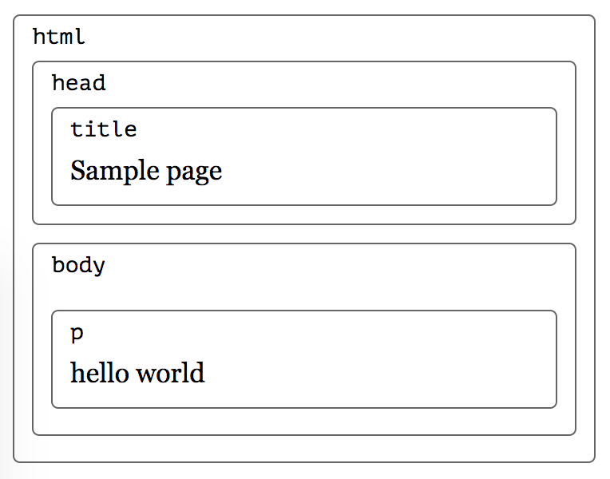
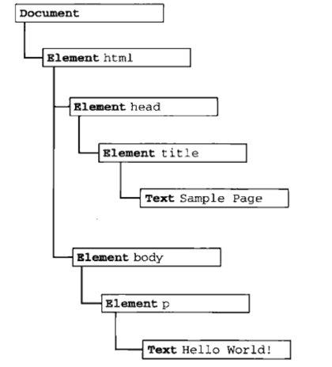
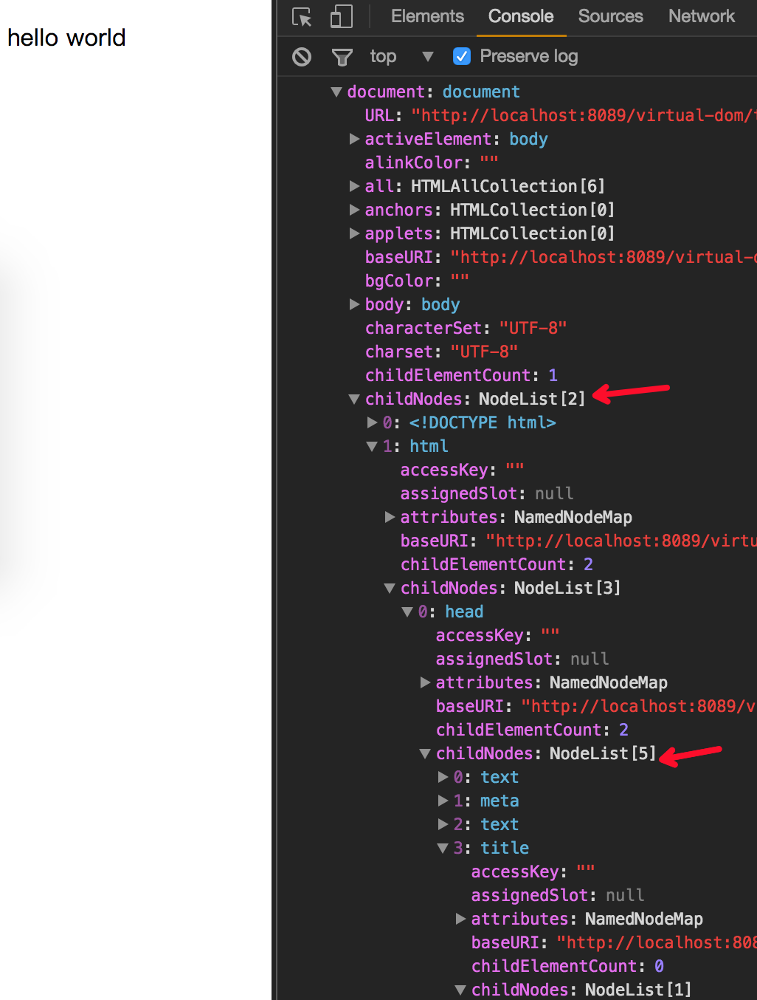

前端在开发页面时不可避免涉及DOM操作，也会有DOM编程之类的说法，那问题来了：
1. 什么是DOM？
2. DOM与JavaScript是什么关系？

# 什么是DOM
浏览器打开网页时，首先会下载页面对应的html文件，下载完成后浏览器会去解析这些html文本，加载相应的css，js文件，
根据所定义的布局绘制页面到屏幕。在页面的js代码中可以对页面标签进行删除，增加，替换等操作。为什么会有这些能力呢？

这个能力就是DOM提供的。DOM(Document Object Mode)是HTML和XML文档的编程接口，它提供了对文档的结构化的表述，
并定义了一种方式可以使从程序中对该结构进行访问，从而改变文档的结构，样式和内容。

就以一个最简单的页面为例:
```html
<!DOCTYPE html>
<html lang="en">
<head>
    <meta charset="UTF-8">
    <title>Sample Page</title>
</head>
<body>
<p>
    hello world
</p>
</body>
</html>
```
可以把上述页面想象一个嵌套的盒子：

对于每一个盒子，都能用一个对象(element对象)来表示，通过这个对象可以对盒子中的内容进行查询或者修改。这其实就是DOM提供的编程接口能力。

浏览器会解析以上代码成一个树状结构：


可以在chrome的devtool中打印window对象，查看其document属性的构造，里面包含具体的解析结果：


这里面的document就是DOM提供的重要数据类型之一，DOM还包含`element`、`nodeList`、`attribute`、`namedNodeMap`等数据类型。
具体可以查看[DOM的重要数据类型](https://developer.mozilla.org/zh-CN/docs/Web/API/Document_Object_Model/Introduction#Important_Data_Types)

# DOM与JavaScript是什么关系
在页面中，js可以通过通过DOM来访问文档和其中的元素，因为每一个在浏览器中打开的页面都会被注入document和window对象，
相当于赋予js操作页面的能力。而页面中的每一个元素——包括整个文档，文档头部，文档标签等，都是文档所属于的文档对象模型（DOM）的一部分，
和修改所以js可以访问页面任意元素。

但是DOM并不是和特定的编程语言强耦合的，像python， java都会自己解析html, xml的库。一般写爬虫的时候会用到。

DOM虽然并不是一个编程语言，但如果没有DOM， JavaScript语言也不会有任何网页，XML页面以及涉及到的元素的概念或模型。可以近似的认为：
>  html 或 XML 页面 = DOM + JS (脚本语言)

# 参考
1. [The Document Object Model](http://eloquentjavascript.net/13_dom.html)
2. [DOM概述](https://developer.mozilla.org/zh-CN/docs/Web/API/Document_Object_Model/Introduction#Important_Data_Types)
3. [DOM 是什么？](https://www.zhihu.com/question/34219998)