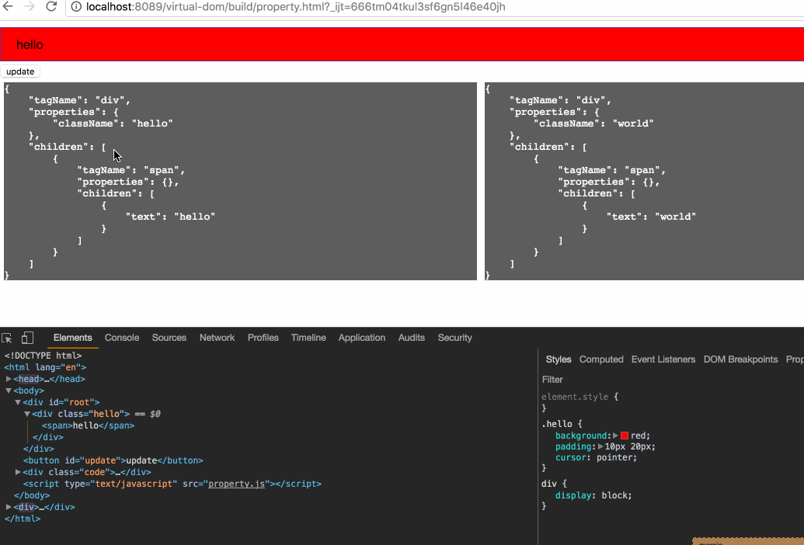

之前已经实现了dom结构的渲染，但一个dom节点都需要设置一些属性，比如常见的class，click事件等，那如何在之前的基础上给dom元素添加属性？

# 添加属性
首先构造一个虚拟DOM
```js
let hello = h("div", {"className": "hello", onClick: function() {alert('you click me')}}, [h("span", "hello")]);
```
其转化后的结构为：
```
{
    "tagName": "div",
    "properties": {
        "className": "hello",
        "onClick": function() {alert('you click me')}
    },
    "children": [
        {
            "tagName": "span",
            "properties": {},
            "children": [
                {
                    "text": "hello"
                }
            ]
        }
    ]
}
```
节点对应的属性都放在`properties`字段下，所以在渲染节点的时候，给节点添加属性即可，先构造一个添加属性的函数
```js
function setProperties(node, properties) {
    Object.keys(properties).forEach(propName => {
        let propValue = properties[propName];
        if (propName.startsWith('on')) {
            // node的事件都是小写
            propName = propName.toLowerCase();
        }
        node[propName] = propValue;
    });
}
```

然后在渲染的时候调用：
```js
function createElement(node) {
    if (isVText(node)) {
        return document.createTextNode(node.text);
    }
    let $el = document.createElement(node.tagName);
    // 渲染节点的属性
    setProperties($el, node.properties);
    node.children.map(createElement).forEach($el.appendChild.bind($el));
    return $el;
}
```

# diff属性
给元素添加属性之后，是时候考虑怎么来对节点属性做diff操作。在diff属性之前，需要思考以下两个问题：
1. 什么时候才需要diff属性
2. diff属性操作本质是什么

一般新增节点，删除节点，或者替换节点时或涉及到dom节点的更新，dom节点都更新了，意味着属性自然而然也被更新了。所以只有当dom节点没有更新时，
才需要考虑属性是否有变化。
因为属性在虚拟dom中存在形式其实就是一个js的对象，所以diff属性操作，本质就是对比两个js对象，然后找出不同点。

明确上述两个问题，先写一个diff属性的方法，也就是diff两个对象：
```js
function diffProps(oldProps, newProps) {
    let diff = {};
    for (let oldKey in oldProps) {
        if (!(oldKey in newProps)) {
            diff[oldKey] = undefined; // 表示需要删除的属性
        }
        else if (oldProps[oldKey] !== newProps[oldKey]) {
            diff[oldKey] = newProps[oldKey];
        }
    }

    for (let newKey in newProps) {
        if (!(newKey in oldProps)) {
            diff[newKey] = newProps[newKey];
        }
    }
    return diff;
}
```
然后在diff节点的时候，如何发现节点结构不用改变，就diff其属性是否有变化：
```js
function diff(a, b) {
    const patch = {a};
    walk(a, b, patch, 0);
    return patch;
}

function walk(a, b, patch, index) {
    let apply = patch[index];
    if (b === null) {
       ...
    }
    else if (isVNode(b)) {
        if (isVNode(a)) {
            if (a.tagName === b.tagName) {
                const propsPatch = diffProps(a.properties, b.properties);
                if (!isEmptyObject(propsPatch)) {
                    appendPatch(apply, new VPatch(CONSTANT.PROPS, a, propsPatch))
                }
            }
            ...
        }
        ...
    }
    ...
}
```
如何属性有变化，添加一个类型为`PROPS`的patch，然后在执行更新的时候，重新调用上述的`setProperties`方法即可。

效果预览：


