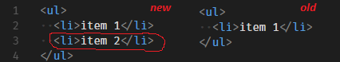
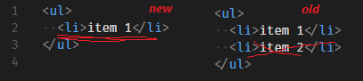
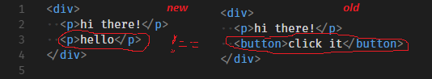

在[构建虚拟DOM](./构建虚拟DOM.md)中，以js对象形式表述了html的结构。
1. 那如何将这个js对象渲染到页面？
2. 渲染之后如果虚拟DOM有变化如何更新页面？

# 渲染DOM
可以先忽略元素的属性，只关注页面的结构，因此可以简化为：
```js
const vdom = { 
    "tagName": "ul",
    "children": [{
        "tagName": "li", 
        "children": ["item 1"]
    }, { 
        "tagName": "li", 
        "children": ["item 2"] 
    }]
}
```
结构一致且又是树状，所以很适合使用递归来处理。DOM提供两种创建节点的形式，一个是`createTextNode`, 一个是`createElement`。
其创建节点流程为：
```
createElement(ul) -------------------- createElement(li) -------- createTextNode('item 1')
                   |
                   |------------------ createElement(li) -------- createTextNode('item 2')

```
新建一个工具函数来描述这个创建流程：
```js
function createElement(node) {
    if (typeof node === "string") {
        return document.createTextNode(node);
    }
    let $el = document.createElement(node.tagName);
    // 递归处理节点包含的子节点，然后添加到改节点上
    node.children.map(createElement).forEach($el.appendChild.bind($el));
    return $el;
}
```
现在已经创建真实DOM节点了，只需将生成结果插入到页面某一个元素下就可以看见效果了。

# 更新DOM
以下几种情景会涉及到更新操作：
1. 新增元素，可以使用`appendChild`来添加节点



2. 删除元素，可以使用`removeChild`来操作



3. 替换元素，可以使用`replaceChild`来完成



（注：以上图片均来源于：[How to write your own Virtual DOM](https://medium.com/@deathmood/how-to-write-your-own-virtual-dom-ee74acc13060)）

针对上述三种情景，新建一个`updateElement`函数，改函数接受三个参数`$parent`、 `newNode`, `oldNode`。
`$parent`表示根元素，即渲染DOM插入节点的那个元素。

1. 如果没有`oldNode`，即初次渲染时，直接新增元素：
```js
function updateElement($parent, newNode, oldNode) {
  if (!oldNode) {
    $parent.appendChild(
      createElement(newNode)
    );
  }
}
```

2. 如果没有`newNode`，即删除节点，因为使用`removeChild`需要传入需要删除dom，需要一个额外的参数来标识需要删除元素的索引位置。
```js
// 使用index来标识需要删除元素的位置
function updateElement($parent, newNode, oldNode, index = 0) {
  if (!oldNode) {
    $parent.appendChild(
      createElement(newNode)
    );
  } else if (!newNode) {
    $parent.removeChild(
      $parent.childNodes[index]
    );
  }
}
```

3. 如果既有`newNode`, 又有`oldNode`，这就有些麻烦了，不仅得判断节点自身有没有变化，还得处理子节点有没有变化。
首先先创建一个工具函数`changed`来判断节点是否有变化
```js
function changed(node1, node2) {
  return typeof node1 !== typeof node2 ||
         typeof node1 === 'string' && node1 !== node2 ||
         node1.tagName !== node2.tagName
}
```
如果节点自身发生变化：
```js
function updateElement($parent, newNode, oldNode, index = 0) {
  if (!oldNode) {
    $parent.appendChild(
      createElement(newNode)
    );
  } else if (!newNode) {
    $parent.removeChild(
      $parent.childNodes[index]
    );
  } else if (changed(newNode, oldNode)) {
    $parent.replaceChild(
      createElement(newNode),
      $parent.childNodes[index]
    );
  }
}
```
如果节点自身没有变化，就得判断子节点是否有变化了：
```js
function updateElement($parent, newNode, oldNode, index = 0) {
  if (!oldNode) {
    $parent.appendChild(
      createElement(newNode)
    );
  } else if (!newNode) {
    $parent.removeChild(
      $parent.childNodes[index]
    );
  } else if (changed(newNode, oldNode)) {
    $parent.replaceChild(
      createElement(newNode),
      $parent.childNodes[index]
    );
  } else if (newNode.type) {
    const newLength = newNode.children.length;
    const oldLength = oldNode.children.length;
    for (let i = 0; i < newLength || i < oldLength; i++) {
      updateElement(
        $parent.childNodes[index],
        newNode.children[i],
        oldNode.children[i],
        i
      );
    }
  }
}
```
结合[构建虚拟DOM](./构建虚拟DOM.md)中的辅助函数，初见虚拟dom的雏形，具体效果[点我查看](http://xchb.work/demo/virtual-dom/representing/index.html)

遗留问题：

如何设置元素的属性，像class， id等。
